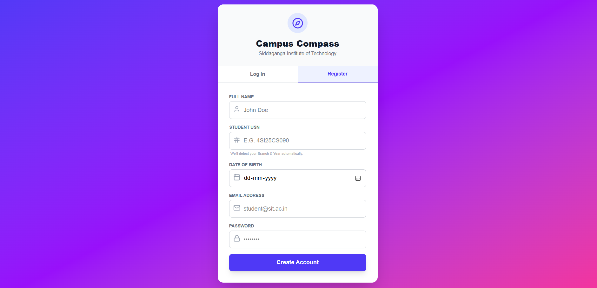
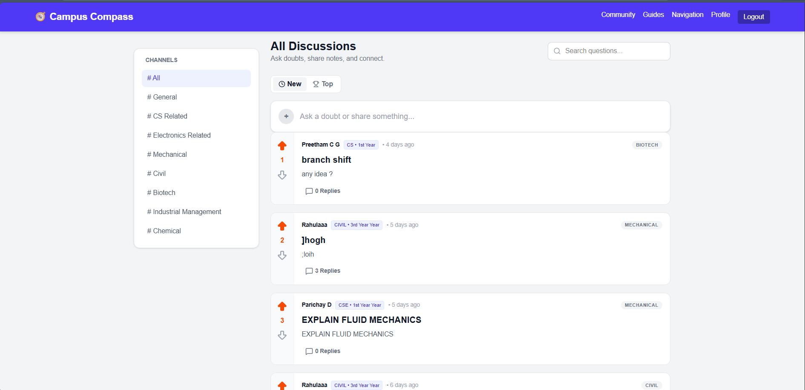
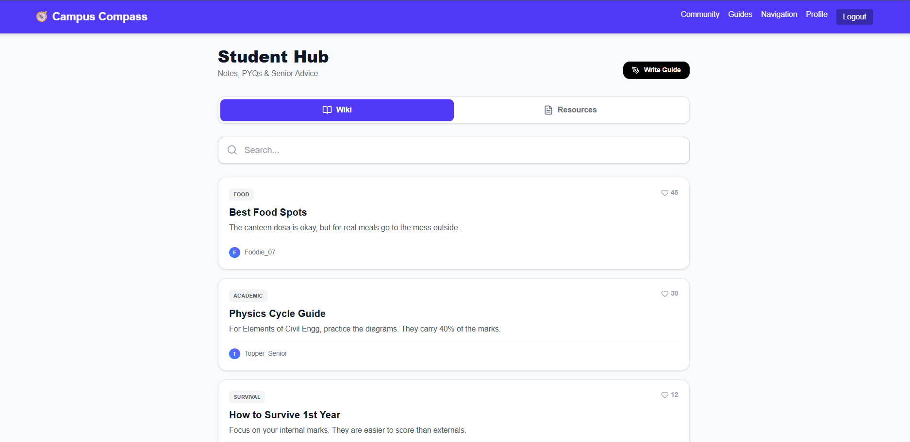

# 🧭 Campus Compass - SIT Tumakuru



> **The All-in-One Digital Guide for Siddaganga Institute of Technology Students.** > *Navigation • Resources • Community • Survival Guides*

[](https://nextjs.org/)
[](https://supabase.com/)
[](https://tailwindcss.com/)
[](https://leafletjs.com/)

---

## 🚀 About The Project

**Campus Compass** is a student-centric PWA (Progressive Web App) designed to help 1st-year students navigate the complex campus of SIT Tumakuru. It bridges the gap between official college data and the "real" information students need—like where to find walking shortcuts, senior advice, and organized study materials.

### 🌟 Key Features

#### 1. Smart Navigation 🗺️
* **Walking Paths:** Unlike Google Maps, this uses customized routing that prioritizes campus footpaths and shortcuts.
* **Live Tracking:** Real-time GPS location to guide you from your hostel to any academic block.
* **Data Source:** Custom coordinates pinned manually using Google My Maps for high accuracy.

#### 2. Student Community 💬
* **Reddit-Style Feed:** A space to ask anonymous or public questions about campus life.
* **Upvote System:** Helpful answers rise to the top.
* **Threads:** Organized discussions on Branch Shifts, Exams, and Events.

#### 3. Senior Wiki (The Knowledge Vault) 📚
* **Survival Guides:** Long-form articles written by seniors (e.g., "Best Food Spots," "Exam Hacks").
* **Verification System:** Guides are manually approved by admins to ensure quality information.

#### 4. Academic Resource Hub 📝
* **Cycle-Specific Filters:** Automatically filters notes for **Physics Cycle** or **Chemistry Cycle**.
* **One-Click Downloads:** Access PDFs of Notes and Previous Year Question Papers (PYQs).
* **Contribution System:** Integrated email support for students to submit missing materials.

---

## 📸 Screenshots

| Smart Map Navigation | Academic Resources |
|:---:|:---:|
|  |  |

| Community Feed | Write a Guide |
|:---:|:---:|
|  |  |

---

## 🛠️ Tech Stack

* **Frontend:** Next.js (React), Tailwind CSS
* **Backend & Auth:** Supabase (PostgreSQL)
* **Maps:** Leaflet.js, OpenStreetMap, OSRM (Routing Machine)
* **Icons:** Lucide React
* **Deployment:** Vercel

---

## 🏃‍♂️ Getting Started locally

This is a **Next.js** project. To run it on your machine:

1.  **Clone the repo:**
    ```bash
    git clone [https://github.com/preetham-1053L/campus-compass.git](https://github.com/preetham-1053L/campus-compass.git)
    ```

2.  **Install dependencies:**
    ```bash
    npm install
    ```

3.  **Set up Environment Variables:**
    Create a `.env.local` file and add your Supabase keys:
    ```bash
    NEXT_PUBLIC_SUPABASE_URL=your_supabase_url
    NEXT_PUBLIC_SUPABASE_ANON_KEY=your_supabase_key
    ```

4.  **Run the development server:**
    ```bash
    npm run dev
    ```

Open [http://localhost:3000](http://localhost:3000) with your browser to see the result.

---

## 🤝 Contribution

Contributions are welcome! Please open an issue or submit a pull request.

**Developed by:** Preetham C G & Team (1st Year CSE)